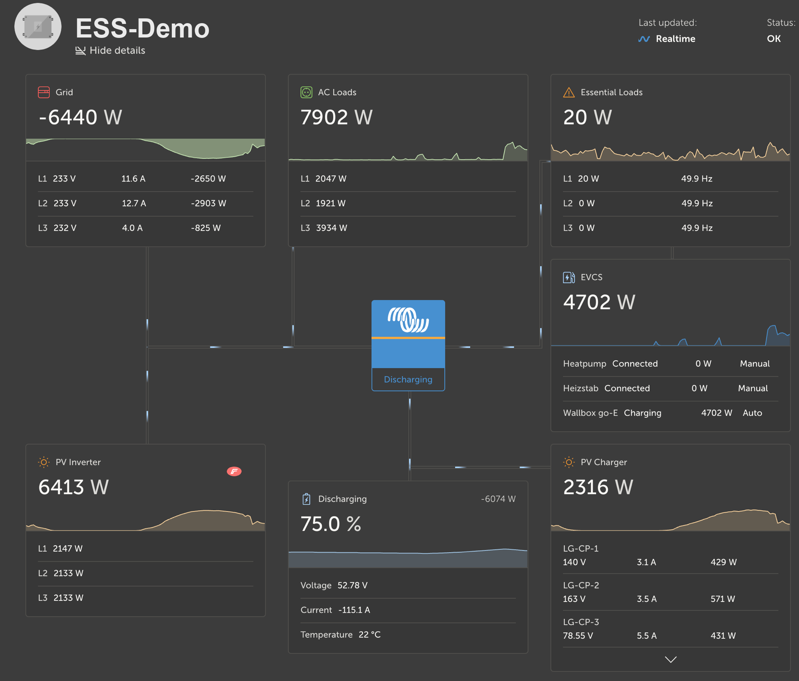
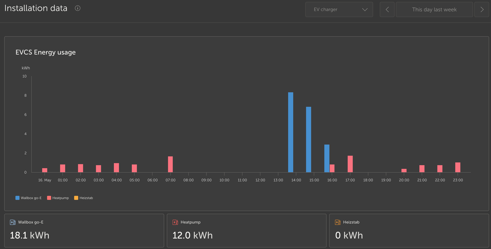
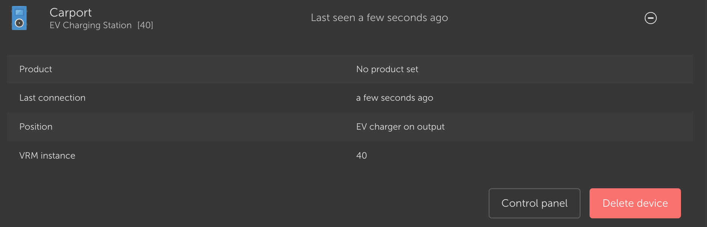

# dbus-evcc-multi

**Bring your [EVCC](https://evcc.io) chargers into the Victron world.**

Run one small service on your Victron [Venus OS](https://github.com/victronenergy/venus)
GX device (Cerbo GX & co.) and every loadpoint from your EVCC setup —
wallbox, heat pump, heating rod, you name it — automatically shows up as its
own EV charger in the Victron GUI and in the VRM portal. Live power, energy
history, the works. No per-charger configuration: add a loadpoint in EVCC and
it appears on the next poll.



> EVCC keeps running where it already runs (a Raspberry Pi, a NUC, …). This
> bridge just connects to it over the network and mirrors its loadpoints onto
> the GX device — nothing about your EVCC install changes.

## Why you'll like it

- 🔌 **Everything in one place** — your chargers live next to your batteries,
  PV and grid data in Victron VRM, including per-charger energy history.
- ✨ **Zero fuss** — point it at your EVCC host once; new loadpoints appear by
  themselves and keep a stable identity across restarts.
- 📈 **Real numbers** — live power per loadpoint and energy logged to VRM.



- 🖥️ **Optional: open the EVCC web UI from VRM** — flip one switch and a
  **"Control panel"** button appears on each charger in VRM that opens the live
  EVCC interface through the VRM relay, no VPN needed.



- 🛟 **Reliable & friendly** — if EVCC is briefly unreachable the bridge just
  waits and keeps showing the last values instead of falling over, and a guided
  installer walks you through setup in one go.

## What you need

- A Victron Venus OS GX device (Cerbo GX or similar) you can reach over SSH.
- An EVCC instance on your network (this bridge reads its `/api/state`).
- That's it — Venus OS already ships everything else the bridge uses.

## Install

The guided installer does everything: it sets up the bridge (and the optional
VRM tunnel), migrates an older single-charger setup if it finds one, asks for
your EVCC address, and starts things up.

**1. Log into your GX device once:**

```sh
ssh root@<gx-device>
```

**2. Then, on the device, download and run the installer:**

```sh
wget -O /tmp/dbus-evcc-multi.tar.gz \
  https://github.com/okuegow/dbus-evcc-multi/releases/download/v2.3/dbus-evcc-multi-v2.3.tar.gz
tar xzf /tmp/dbus-evcc-multi.tar.gz -C /data
/data/dbus-evcc-multi/setup.sh
```

`setup.sh` asks a few simple questions (your EVCC host, and whether to enable
the VRM Control panel) and then starts everything. Run it again any time to
change settings later. After a minute your chargers appear in VRM. 🎉

<details>
<summary>Prefer to do it by hand? (manual install)</summary>

After logging in (step 1 above), run on the device:

```sh
# download & extract
wget -O /tmp/dbus-evcc-multi.tar.gz \
  https://github.com/okuegow/dbus-evcc-multi/releases/download/v2.3/dbus-evcc-multi-v2.3.tar.gz
tar xzf /tmp/dbus-evcc-multi.tar.gz -C /data

# set your EVCC address, then install and watch the log
vi /data/dbus-evcc-multi/config.ini          # ONPREMISE/Host = <ip>:7070
/data/dbus-evcc-multi/install.sh
tail -F /data/log/dbus-evcc-multi/current | tai64nlocal
```

On a first install the service starts in a "down" state so you can set the
config before it runs. `install.sh` registers itself so it survives Venus OS
firmware updates.
</details>

## Configuration (`config.ini`)

| Section | Key | Meaning |
|---|---|---|
| `DEFAULT` | `PollSeconds` | Poll interval in seconds (default 15) |
| `DEFAULT` | `DeviceInstanceRangeStart` / `End` | DeviceInstance range (default 40–59) |
| `ONPREMISE` | `Host` | `<ip>:<port>` of your EVCC host |
| `VRM_TUNNEL` | `Enabled` | Show the VRM "Control panel" button (default `false`) |
| `VRM_TUNNEL` | `AdvertiseIp` | The LAN IP VRM should tunnel to (the GX or EVCC host) |
| `VRM_TUNNEL` | `EvccTarget` | Where the proxy forwards (e.g. `127.0.0.1:7070`) |
| `VRM_TUNNEL` | `ProxyPort` | Local proxy port (default `8099`) |

The guided `setup.sh` fills these in for you.

## Coming from an older single-charger setup?

Earlier setups ran one bridge per charger under `/data/dbus-evcc-<name>/`. The
installer detects those and offers to migrate them so your chargers keep their
existing VRM history. You can also run the migrator yourself (after logging in):

```sh
python3 /data/dbus-evcc-multi/migrate_from_lp.py --dry-run        # preview
python3 /data/dbus-evcc-multi/migrate_from_lp.py --auto --uninstall-old
```

It reads each old config, matches it to the current EVCC loadpoint titles, and
writes the mapping to `state.json`.

## Good to know

- **Add a loadpoint in EVCC** → it appears automatically on the next poll with
  a stable DeviceInstance.
- **Reorder loadpoints in EVCC** → no effect; identity stays with the title.
- **Rename a loadpoint in EVCC** → the old name is marked offline and the new
  name starts fresh (its own VRM history). Best avoided where possible.
- **EVCC unreachable** → logged as a warning; existing chargers keep their last
  values and nothing is torn down.

## Diagnostics

```sh
svstat /service/dbus-evcc-multi                            # is it running?
dbus -y | grep evcharger                                   # list the chargers
tail -F /data/log/dbus-evcc-multi/current | tai64nlocal    # readable log
```

## How the VRM "Control panel" works (optional feature)

When enabled, each charger is advertised so that VRM shows a **Control panel**
button for it. A small bundled service then makes the VRM relay forward to your
EVCC web UI (it rewrites EVCC's `/login.htm` and routes the connection to EVCC),
so the button opens the live EVCC interface — without a VPN. It's off by default
and changes nothing until you turn it on.

## Development

```sh
python3 -m venv .venv && . .venv/bin/activate
pip install -r requirements-dev.txt
python -m pytest -q          # ~177 tests
```

The pure logic is unit-tested on a normal machine; the Venus OS D-Bus / iptables
parts are exercised on real hardware. CI runs the tests and shellcheck on every
push.

## Credits

Inspired by the Venus OS `dbus-evcc` community work, and by the Victron
community's multi-service and logging patterns.

## License

[MIT](LICENSE) © 2026 Oliver Kügow.

Not affiliated with or endorsed by EVCC or Victron Energy.
